# TeamCity Installation 

Click on "Upgrade your existing TeamCity installation":
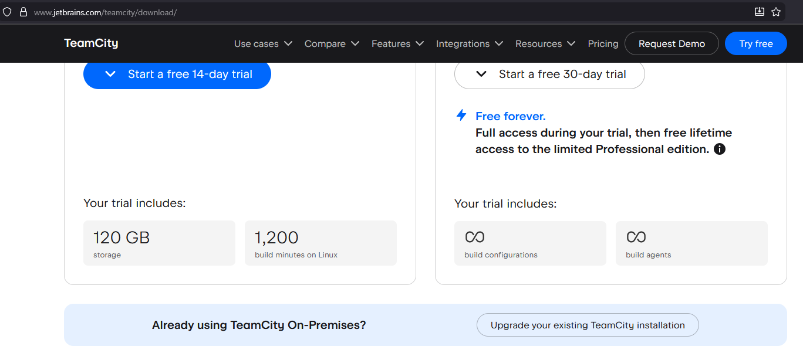
- https://www.jetbrains.com/teamcity/download/

Download the latest exe
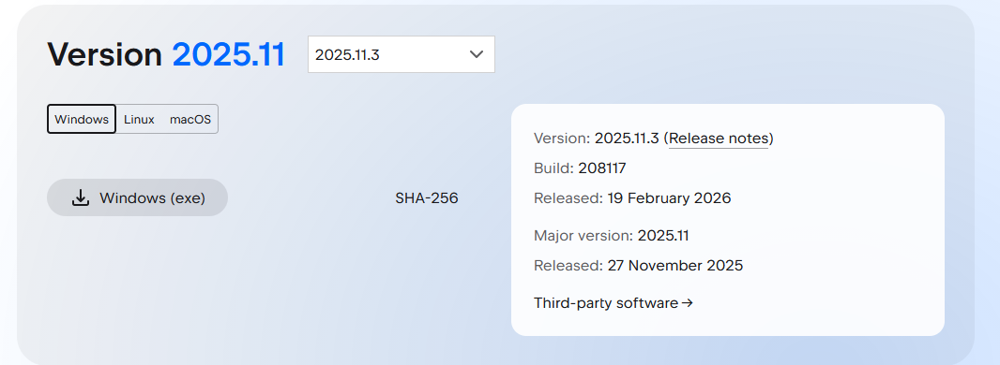

Click next until the agent and server is installing:
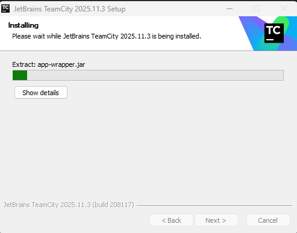

Rename the name to anything or leave it as the hostname then click `save`:
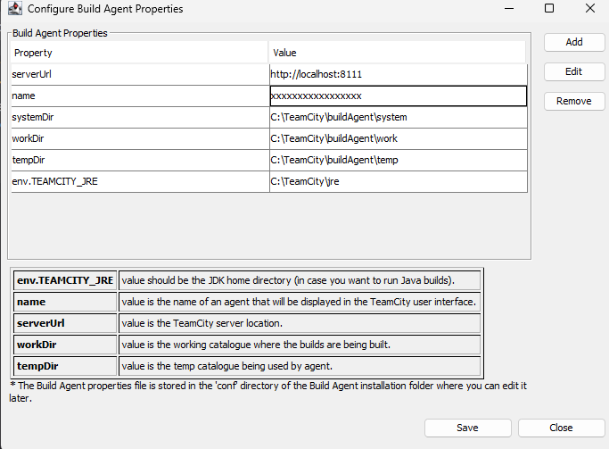

Select SYSTEM account unless you have a different use case:
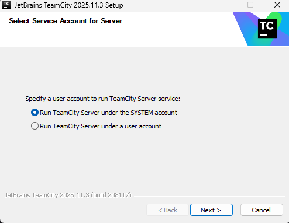

Click on `Proceed` -> `Proceed` -> `Accept`
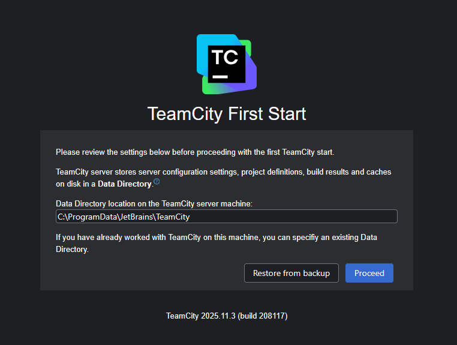

# Setting up TeamCity

Create your administrator account:
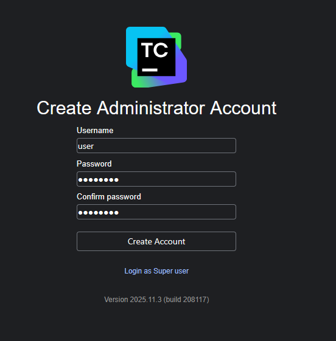

## Creating project

Create a new project and select `GitLab` > `GitLab CE/EE`:
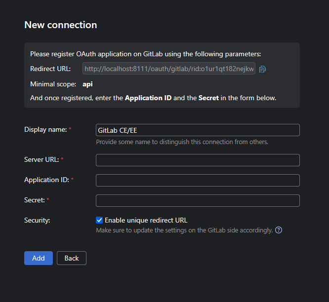

**GitLab is required to be set up to continue**

Go to `User settings` -> select `Applications` > `Add new application`:
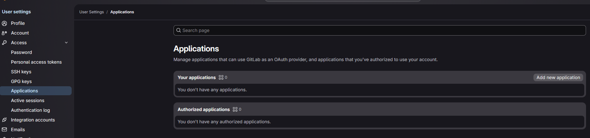

For this example, just provide all the permissions and click `Save application`: 
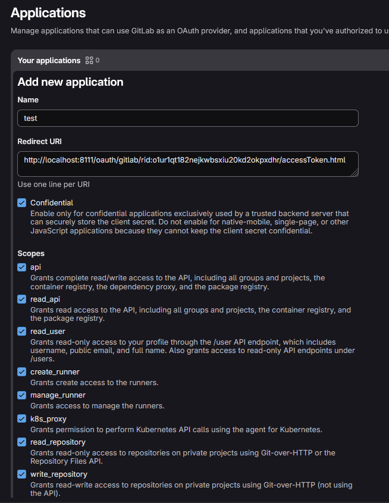
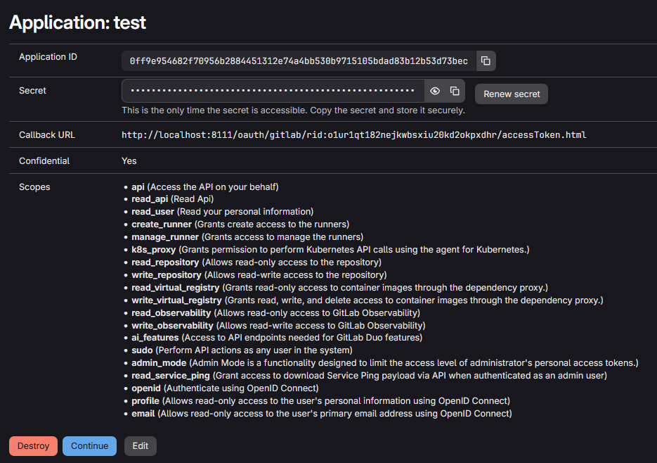
Fill the configuration from the GitLab and click `add`:
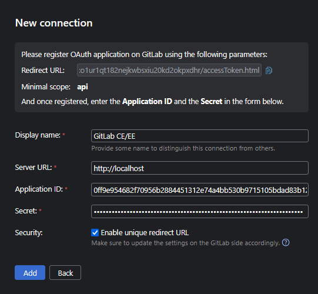
Create a blank project in GitLab:
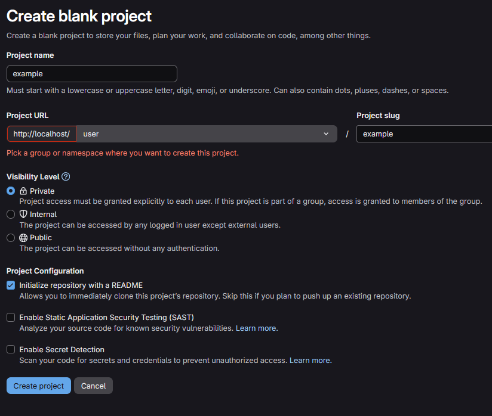
Connect the project in TeamCity:
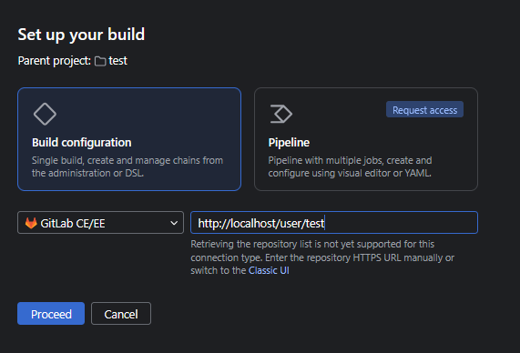

## Build Project
Download .NET on your "agent" to build the application (https://visualstudio.microsoft.com/downloads/)

Once your agent is able to build, open `Build Steps` and click `Auto-detect build steps`:
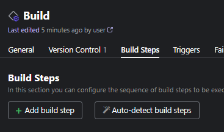
If you try building now, it will not provide the artifact, Click on `Edit` to add the artifacts:
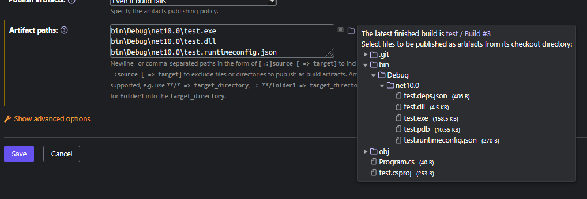
# GitLab Installation (WSL)

```bash
mkdir /opt/gitlab
mkdir /opt/gitlab/data
mkdir /opt/gitlab/config
mkdir /opt/gitlab/logs
```

Create `docker-compose.yml`:
```
services:
  gitlab:
    image: 'gitlab/gitlab-ce:latest'
    container_name: 'gitlab'
    restart: always
    hostname: 'localhost'
    environment:
      GITLAB_OMNIBUS_CONFIG: |
        external_url 'http://localhost'
    ports:
      - '80:80'
      - '22:22'
#     - '443:443'
    volumes:
      - '/opt/gitlab/config:/etc/gitlab'
      - '/opt/gitlab/logs:/var/log/gitlab'
      - '/opt/gitlab/data:/var/opt/gitlab'
    shm_size: '256m
```

Run gitlab server and wait for a bit for the server to load:
```bash
docker compose up -d
```

Locate generated password for root:
```bash
docker exec -it gitlab grep 'Password:' /etc/gitlab/initial_root_password
```

Login with root:\<password\> at `http://localhost`
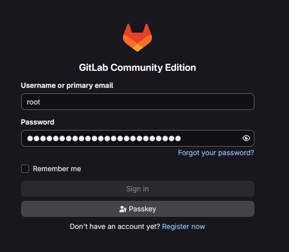

# Setting up GitLab

## Creating user

Open admin panel:


Go to users tab:
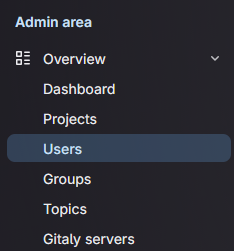

Click `add user`
Add the user details (Use a temporary email)
Click `Create User`


After creating use click `Edit`:
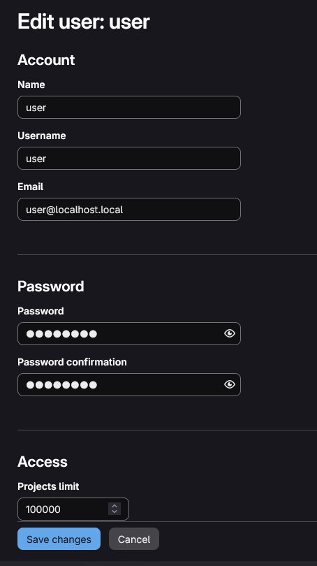

Logout and login with the created user (Will be prompt to reset password):
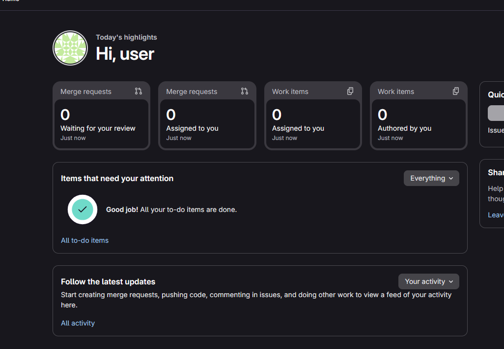

## Creating dotnet project

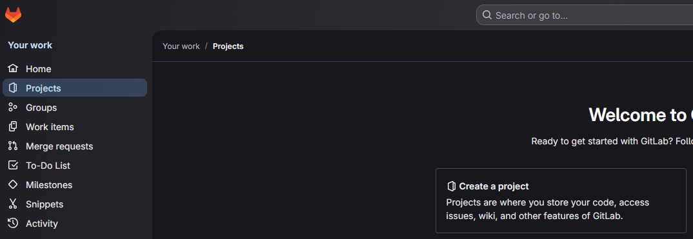

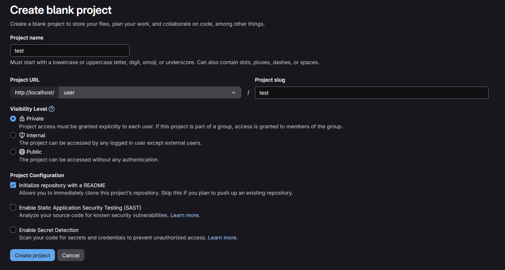

Create a dotnet application and push to GitLab:
```powershell
mkdir test
cd test
git init
git remote add origin http://localhost/user/test.git
git branch -M main
dotnet new console
git add --all
git commit -m "v1.0"
git push -uf origin main
```

The git push will be rejected:
```powershell
C:\Users\user\Desktop\test>git push -uf origin main
Enumerating objects: 10, done.
Counting objects: 100% (10/10), done.
Delta compression using up to 24 threads
Compressing objects: 100% (9/9), done.
Writing objects: 100% (10/10), 5.46 KiB | 5.46 MiB/s, done.
Total 10 (delta 1), reused 0 (delta 0), pack-reused 0 (from 0)
remote: GitLab: You are not allowed to force push code to a protected branch on this project.
To http://localhost/user/test.git
 ! [remote rejected] main -> main (pre-receive hook declined)
error: failed to push some refs to 'http://localhost/user/test.git'
```

The main branch is protected, as a temporary solution, just unprotect it.
Go to Project settings > `Repository` > `Protected branches` > `Unprotect`:
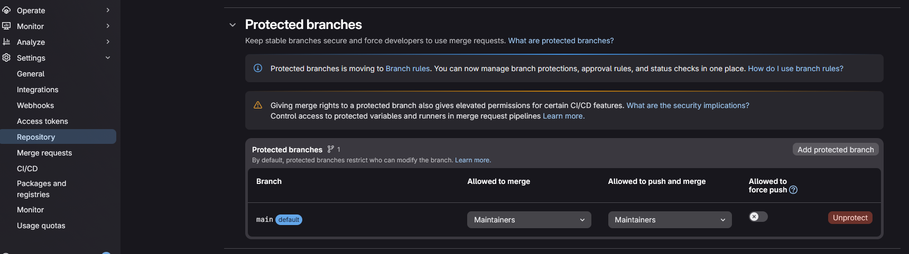

Git push again, it should now work:
```
git push -uf origin main
```